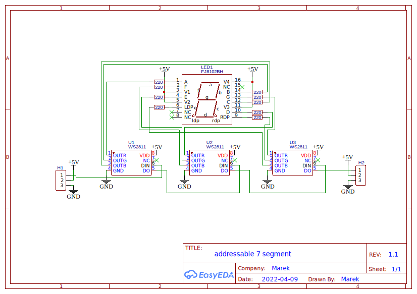

## Table of content
<!-- TOC tocDepth:2..3 chapterDepth:2..6 --> 
- [Table of content](#table-of-content)
- [Introduction](#introduction)
    - [Schematics](#schematics)
    - [Bill of materials](#bill-of-materials)
    - [Pick and Place](#pick-and-place)
    - [Gerber File](#gerber-file)
- [GitHub](#github)
- [Library](#library)
<!-- /TOC -->

## Introduction

#### Schematics

{}Get Schematics{}

#### Bill of materials
{}Get Bill of Materials{}

#### Pick and Place
{}Get Pick and Place{}

#### Gerber File
{}Get Gerber{}

## GitHub 
{}Goto GitHub{}

## Library
{{% button href="https://registry.platformio.org/libraries/marek128b/Addressable%20Seven%20Segment%20Display" style="red" %}}Platformio Library{}

