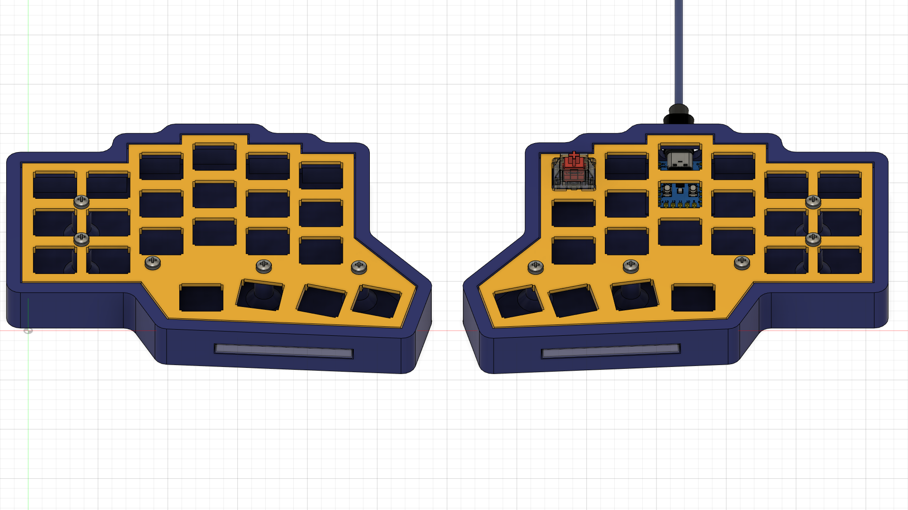
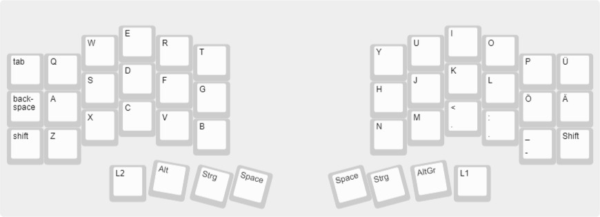
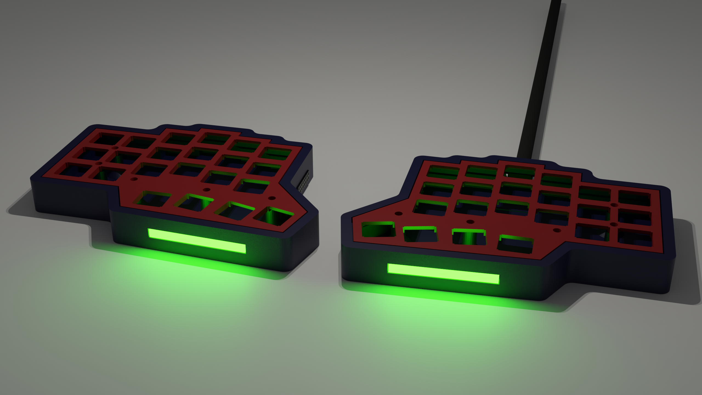
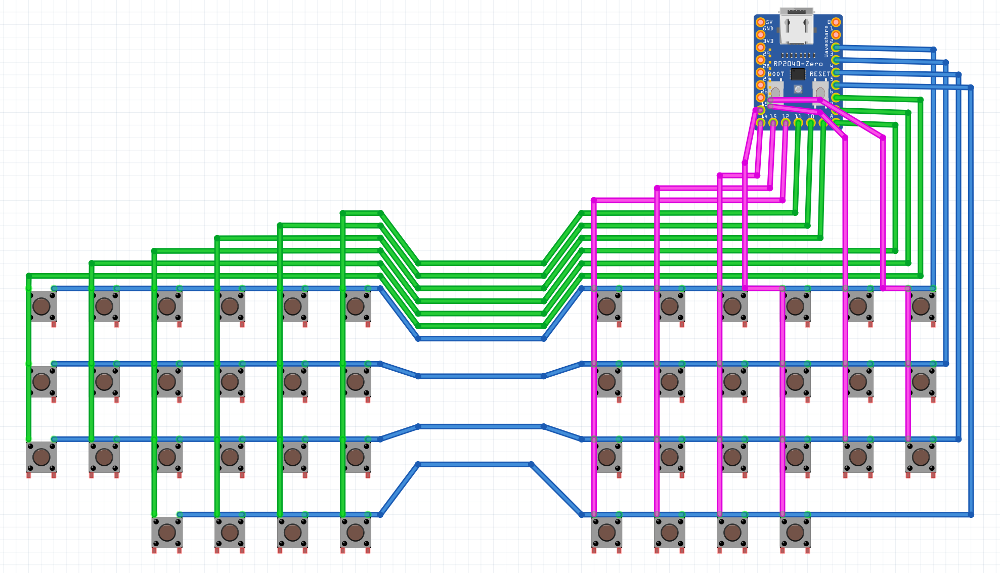
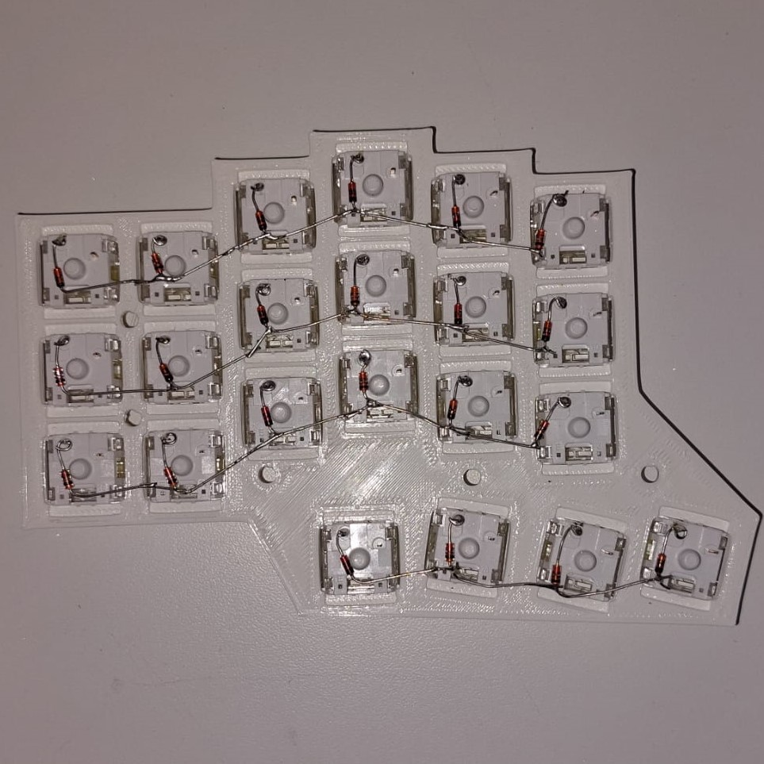
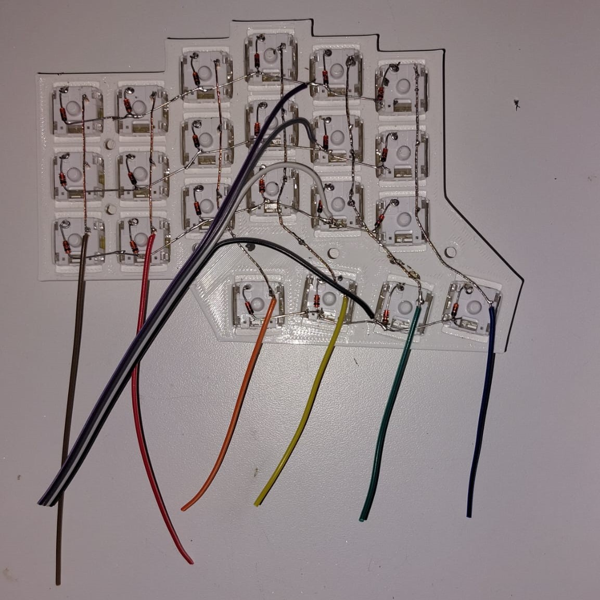

## Table of content
<!-- TOC tocDepth:2..3 chapterDepth:2..6 --> 
- [Table of content](#table-of-content)
- [Introduction](#introduction)
  - [Circuit](#circuit)
    - [Bill of materials](#bill-of-materials)
    - [Pick and Place](#pick-and-place)
    - [Gerber File](#gerber-file)
- [GitHub](#github)
- [Library](#library)
<!-- /TOC -->

## Introduction

The ErgoSplit50 is a 50% split keyboard which means that the keyboard is in two half's which is better for ergonomics than a "normal" keyboard. A 50% Keyboard is smaller compared to a normal 100% keyboard with function and number keys as well as a num keys.
The Keyboard has a ortho linear key layout which is more ergonomic than the staggered key layout (normal layout).

___
Here you can see both half of the keyboard built using [Keyboard Layout Editor](http://www.keyboard-layout-editor.com/#/gists/dc776eb6e80d4ed39cddeabd265ff729)  

___
This keyboard layout is better for ergonomics as it accommodates the different sizes of your fingers. 

### Circuit

|image|image|
|-----|-----|
||

#### Bill of materials
{}Get Bill of Materials{}

#### Pick and Place
{}Get Pick and Place{}

#### Gerber File
{}Get Gerber{}

## GitHub 
{}Goto GitHub{}

## Library
{{% button href="https://registry.platformio.org/libraries/marek128b/Addressable%20Seven%20Segment%20Display" style="red" %}}Platformio Library{}

