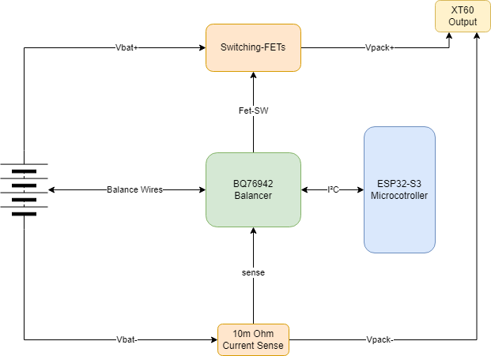
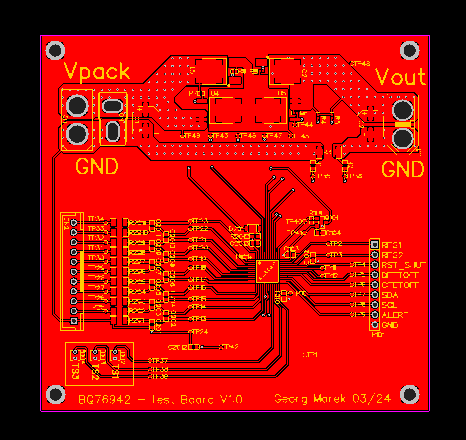

## Table of content
<!-- TOC tocDepth:2..3 chapterDepth:2..6 -->
- [Table of content](#table-of-content)
- [Introduction](#introduction)
  - [Test Board V1.0](#test-board-v10)
    - [Voltage Switcher](#voltage-switcher)
    - [Schematics](#schematics)
    - [Bill of materials](#bill-of-materials)
    - [Pick and Place](#pick-and-place)
    - [Gerber File](#gerber-file)
- [Datasheets](#datasheets)
  - [BQ76942](#bq76942)
  - [BQ76942 Technical Reference Manuel](#bq76942-technical-reference-manuel)
- [GitHub](#github)
<!-- /TOC -->

## Introduction

{}
Project is On halt.
{}

The BQ76942 Balancer is an integrated circuit specifically designed for battery management applications, with a particular focus on multi-cell lithium-ion or lithium-polymer battery packs. 
Serving as a sophisticated component of a battery management system (BMS), the BQ76942 offers advanced functionalities such as monitoring cell voltages, balancing charge distribution, and sensing temperature levels. 
Its primary objective is to ensure the safe and efficient operation of battery packs by closely monitoring individual cell voltages and temperature, thereby preventing issues like overcharging, over-discharging, and thermal runaway. 
By redistributing charge among cells, the balancer functionality maintains optimal cell balance, extending battery life and enhancing the overall reliability of the system. With its compact size and comprehensive range of features, the BQ76942 Balancer plays a crucial role in the design and implementation of high-performance battery management systems across various applications, including electric vehicles, renewable energy storage systems, and portable electronics.

|Image|Image|
|-----------------------------------------------|----------------------------------------------------|
|||

### Test Board V1.0

#### Voltage Switcher 
The problem stems from the need to create links between the last battery cell and the VC10 and BAT terminals of the integrated circuit (IC), along with the obligation to connect the second-to-last battery cell, starting from its connection point (e.g., 3S Battery VC3), to all previous cell connections that lead to the BQ76942 Battery Management IC, except for the VC10 connection as this Pin has to be connected to the last Cell of the Battery pack.

First test board of charger IC BQ24600.
|Image|Image|
|--------------------------------------------------|-------------------------------------------------------|
|||

#### Schematics
{}Get Schematics svg{}
{}Get Schematics PDF{}

#### Bill of materials
{}Get Bill of Materials{}

#### Pick and Place
{}Get Pick and Place{}

#### Gerber File
{}Get Gerber{}

## Datasheets
### BQ76942
{{% button href="https://www.ti.com/lit/ds/symlink/bq76942.pdf?ts=1739520900237&ref_url=https%253A%252F%252Fwww.ti.com%252Fproduct%252Fde-de%252FBQ76942" style="accent" icon="download" iconposition="right" %}}Get Datasheet{}

### BQ76942 Technical Reference Manuel
{}Get Technical Reference Manuel{}

## GitHub 
{}Goto GitHub{}
