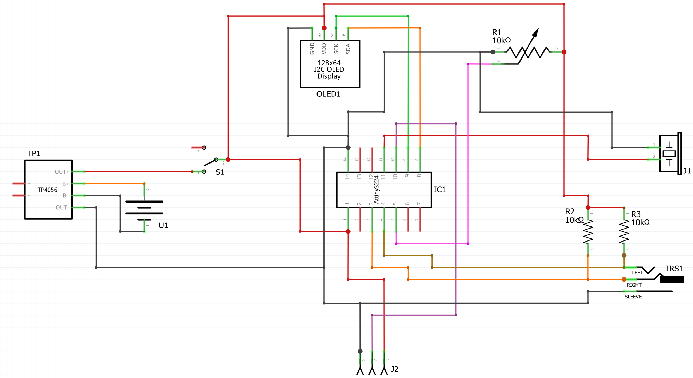
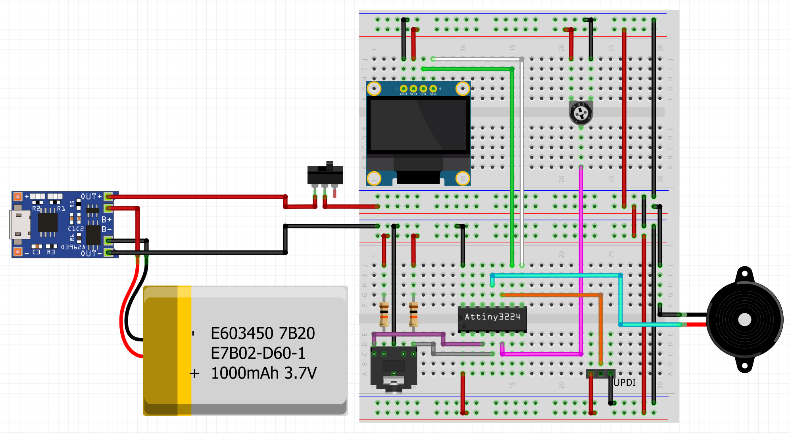
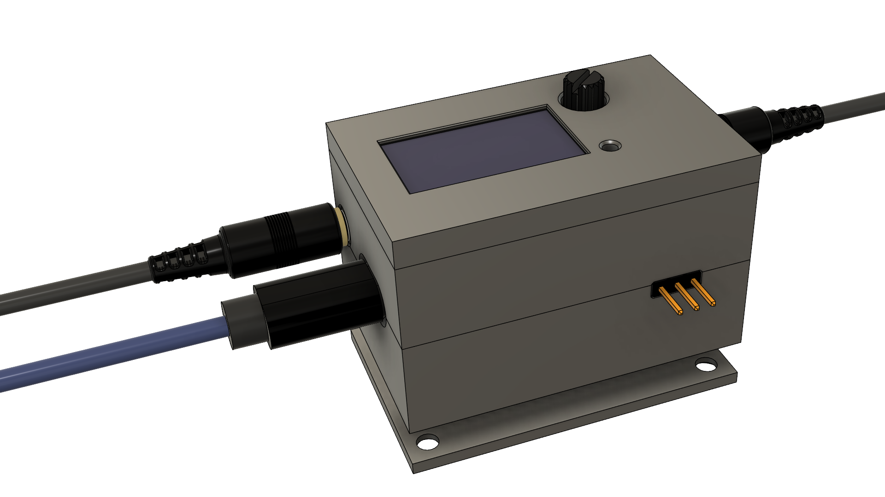
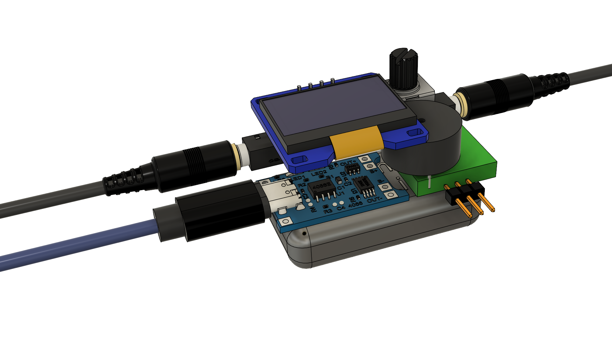

## Table of content
<!-- TOC tocDepth:2..3 chapterDepth:2..6 -->

- [Table of content](#table-of-content)
- [Introduction](#introduction)
  - [Idee](#idee)
    - [Uploading](#uploading)
    - [Fritzing Diagramm](#fritzing-diagramm)
  - [3D Files](#3d-files)
    - [Schematics](#schematics)
    - [Image Files](#image-files)
- [Datasheets](#datasheets)
  - [Attiny3224](#attiny3224)
- [GitHub](#github)

<!-- /TOC -->


## Introduction

{}
Project is Done!
{}

A morse code keyer using an attiny3224.

### Idee
Die Idee ist es mit einen kleinen [attiny3224](https://ww1.microchip.com/downloads/en/DeviceDoc/ATtiny3224-3226-3227-Data-Sheet-DS40002345A.pdf) Signale von einen [Morse code Paddel](https://www.google.com/search?num=10&client=opera-gx&hs=34a&sca_esv=35aa2c76c27153e3&udm=2&sxsrf=ADLYWIJNDN7UjPOz0VhaK0SqfWdCEP65fw:1734516989521&q=Morse+code+paddle&spell=1&sa=X&ved=2ahUKEwjJqpGoi7GKAxWI_rsIHbHGCxgQBSgAegQIBxAB&biw=1879&bih=961&dpr=1) zu empfangen mittels eines[ TRS Audio Kabels](https://www.google.com/search?num=10&client=opera-gx&hs=Jlv&sca_esv=35aa2c76c27153e3&sxsrf=ADLYWILwK7m34vGVwkyYpZV38UtCFHoV7g:1734517048844&q=TRS+Audio+Cable+3.5mm&udm=2&fbs=AEQNm0A6bwEop21ehxKWq5cj-cHaRtK5aHdXzYJtdBHDF1RovJ9x8AQTQtMnrHD1E_-ebSulVWrhUCbGu8iEVaF0zSn6NU2lvqLFoxAnZFG4MnqiLoXjVIOPOqk_dq3zjUKhvpR5jvfgcfddzTBfuJAT4bnCLbkfO344NmvQCTZvVF8nPLie62kJthQygxBflQQ9mTuU3NAD&sa=X&ved=2ahUKEwjBkLbEi7GKAxU0gf0HHZ-iJRwQtKgLegQIFxAB&biw=1879&bih=961&dpr=1#vhid=Dzf5uwzuh5V89M&vssid=mosaic). 
Mit einen Potentiometer wird die Morse Geschwindigkeit von 4WPM bis 40WPM eingestellt.
Auf einen [0.96 Inch OLED](https://www.amazon.de/AZDelivery-Display-Arduino-Raspberry-gratis/dp/B01L9GC470?__mk_de_DE=ÅMÅŽÕÑ&crid=1NSYHKD7MIZ1Y&dib=eyJ2IjoiMSJ9.R54k2LtwFBVEaKZM9DrYvOVqCzH6gYfAX2oL11jytvHHWMZBUvQoGgzcOYKEEyyJioMKEtEIN98uU7nZDAr1wlA-Z5-FRVl6J0uX6i1eC2lcOhDumDB5jq201ooN_mxqo6m8SBv_H1Z_qib0SPZd9y4subcLMX5zkaiK3ooJgzlicLfW26n_SHiZlBzXAZy6ZJv1VcPlAGjPXoHVzNVbV1YkRvMb8YXhLBB2h-sU6kw.o5Ge-RLWhK1o79UA5647Tvx1vCDhO7gEbPWJY2UTD2c&dib_tag=se&keywords=0.96+Inch+OLED&nsdOptOutParam=true&qid=1734517252&sprefix=0.96+inch+oled%2Caps%2C151&sr=8-2) wird die aktuell eingestellte Geschwindigkeit eingestellt. 
Ausgegeben wird dann ein generiertes [Morse Code](https://de.wikipedia.org/wiki/Morsecode)Signal als Auditive Ausgabe mittels eines Buzzers und als Keyer Ausgangs mit einen Transistor. 
Mit einen kleinen 3D gedruckten werden alle Komponenten zusammen gehalten und dadurch kann man es dann einfach mitnehmen. 

#### Uploading 

Mit [pymcuprog](https://pypi.org/project/pymcuprog/) wird der code hochgeladen. Dafür muss pymcuprog installiert und:

```
upload_flags =
    --tool
    uart
    --device
    ATtiny3224
    --uart
    $UPLOAD_PORT
    --clk
    $UPLOAD_SPEED
upload_command = pymcuprog write --erase $UPLOAD_FLAGS --filename $SOURCE
```
in der Platformio.ini Datei stehen.

#### Fritzing Diagramm




### 3D Files



#### Schematics
{}Get Schematics{}

#### Image Files
{}Goto Images{}


## Datasheets
### Attiny3224
{}Get Datasheet{}

## GitHub 
{}Goto GitHub{}
